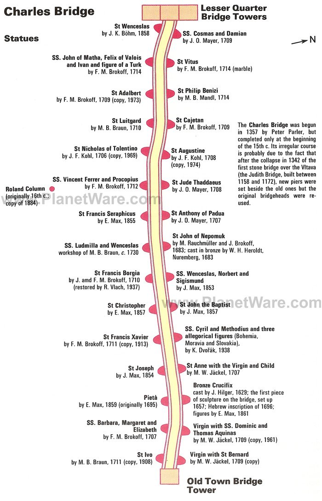

# Day 1

## Charles Bridge

One of the most recognizable old bridges in Europe, magnificent Charles Bridge (Karluv Most) boasts 32 unique points of interest along its 621-meter span. Built in 1357, the bridge has long been the subject of a great deal of superstition, including the builders having laid the initial bridge stone on the 9th of July at exactly 5:31am, a precise set of numbers (135797531) believed to give the structure additional strength. For added good measure, it was constructed in perfect alignment with the tomb of St. Vitus and the setting sun on the equinox.

The bridge is particularly famous for its many fine old statues. Among the most important are those of Holy Roman Emperor Charles IV and John of Nepomuk, the country's most revered saint, unveiled in 1683 (a more recent superstition involves rubbing the plaque at the base of the statue for the granting of a wish).

Other highlights include spectacular views over the River Vltava and the structure's superb Gothic gates. Viewing Charles Bridge at night is also highly recommended (an added benefit are the smaller crowds, particularly after the spectacular sunset).